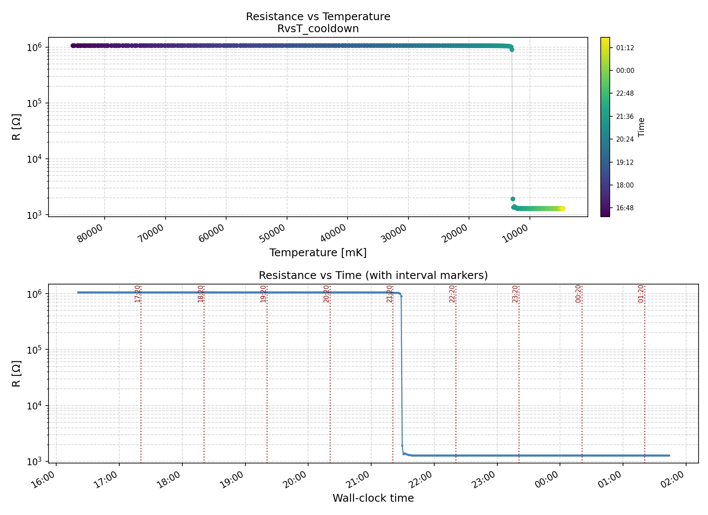

# res_vs_time
Resistance measurements over time to find Tc

The script RvsT.py uses a digital multimeter connected directly to the cryostat ports' that lead to the superconducting device. The script measures resistance every a fixed amount of seconds, and registers the temperature through reading the Lakeshore temperature monitor log. It stops after the temperature reaches a certain value in [K].

It produces a plot like the following:

